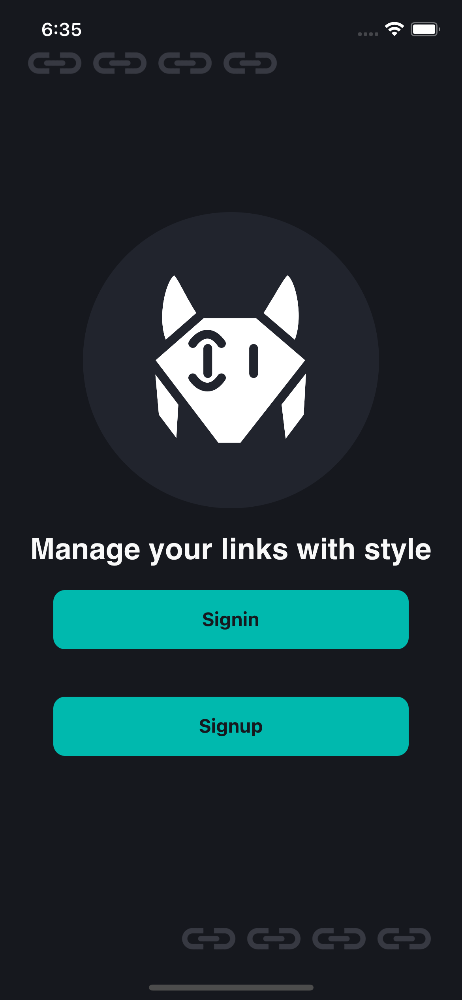
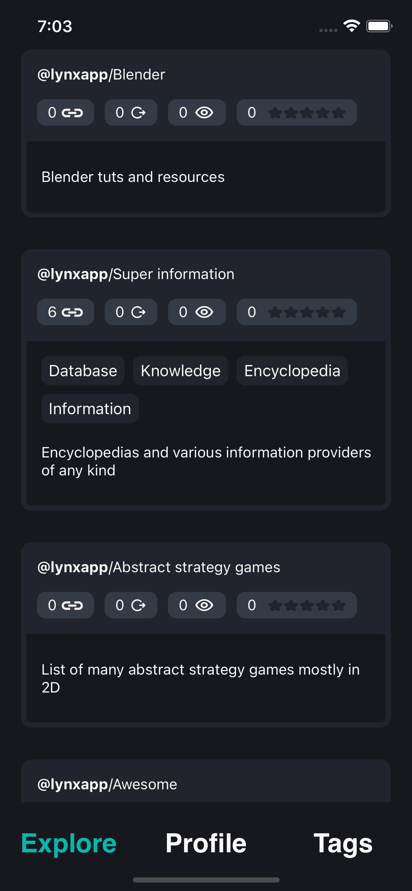
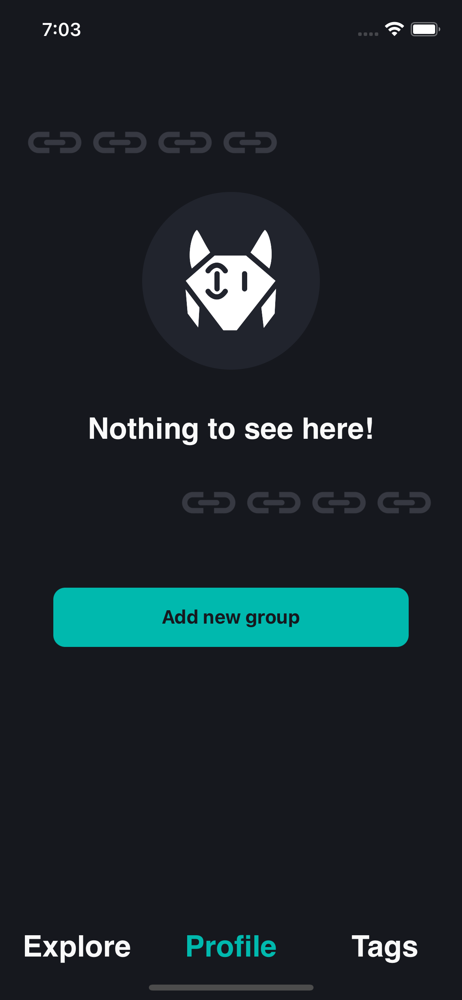
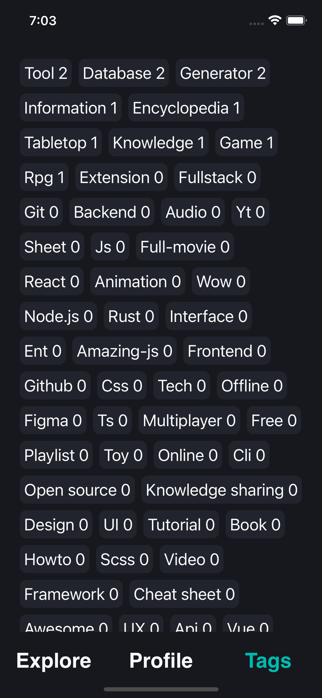
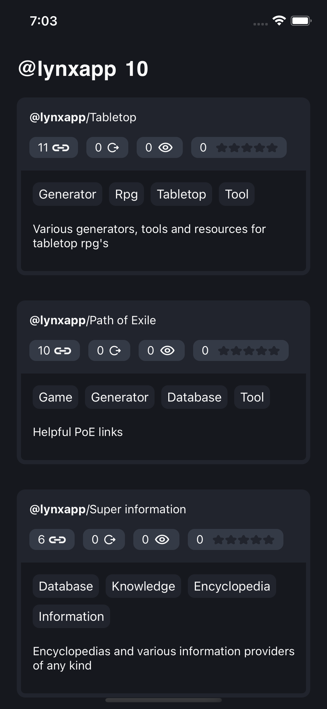
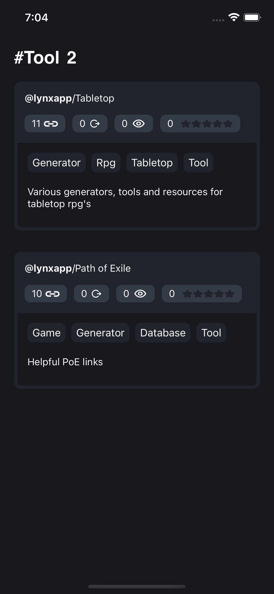
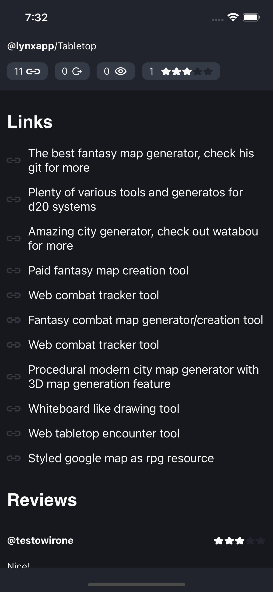
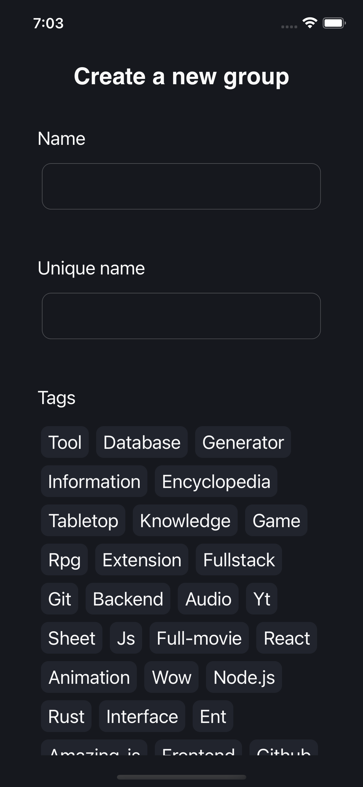

    
  <h1 align="center">Lynx</h1>
  

        Mobile app for <a href="https://github.com/net-runner/lynx">Lynx - link sharing platform</a> 
  

## Tech Stack
- **Database**: PostgresSQL & Prisma as a ORM
- **Frontend**: React Native
- **Backend**: Node.js + Hyper-Express

## Screenshots

| StartScreen.tsx | HomeScreen.tsx |
|:-------------------------:|:-------------------------:|
||

| UserScreen.tsx | TagListScreen.tsx |
|:-------------------------:|:-------------------------:|
||

| OtherUserScreen.tsx | TagScreen.tsx |
|:-------------------------:|:-------------------------:|
||

| LinkGroupScreen.tsx | CreateGroupScreen.tsx |
|:-------------------------:|:-------------------------:|
||